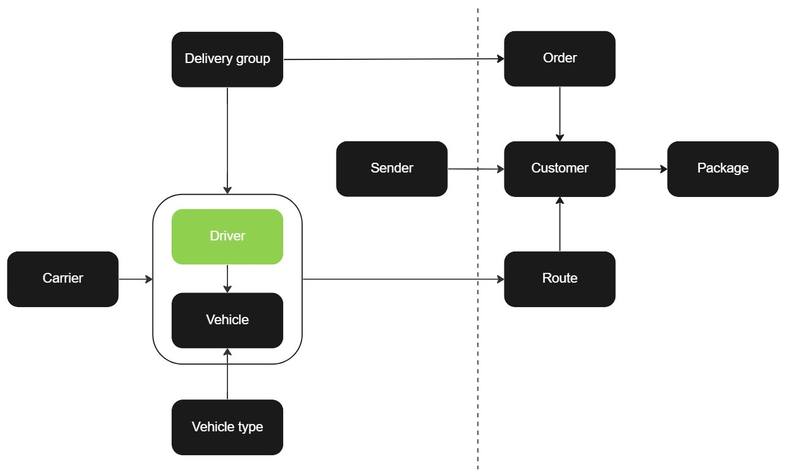

# Driver

Drivers are a crucial component in the delivery process and must be linked to a pre-existing [delivery group](delivery_group.md) to be created. Additionally, they may also be associated with a [carrier](carrier.md) if necessary. The creation of [routes](route.md) is not dependent on the availability of drivers but you can't start a route without a driver available. The API encompasses various functions for managing drivers, including adding, retrieving and deleting them.

