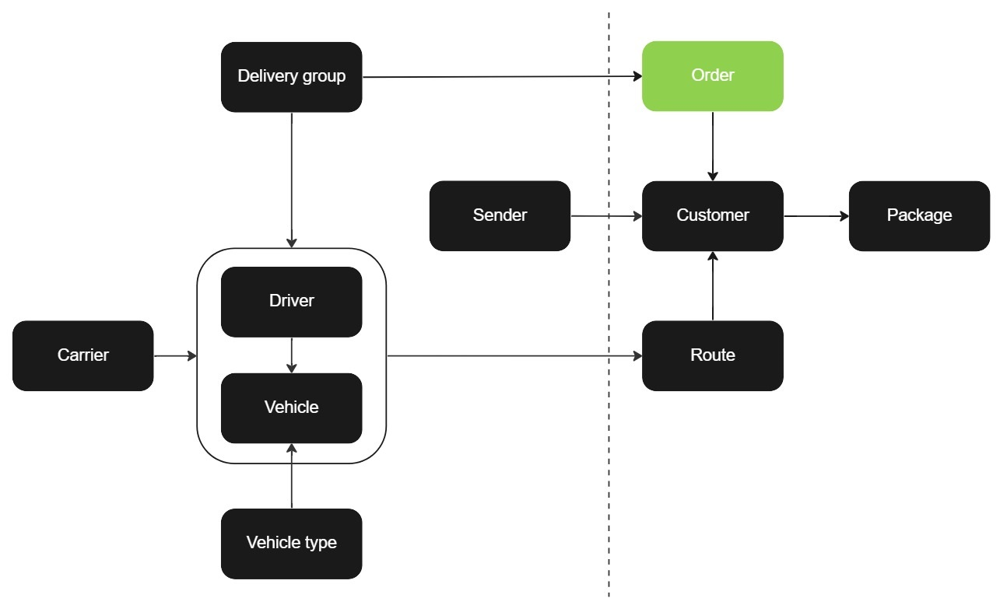

# Routing order

A routing order creation requires the presence of an existing [delivery group](delivery_group.md) as it must be linked to the routing order. To create a routing order, it's crucial to have a delivery group in place. To manage routing orders, you can add, retrieve, and import them. Each routing order can have one or multiple [customer orders](customer_order.md) along with their [packages](package.md), and one or multiple delivery routes can be assigned to the routing order. A routing order can be connected to a customer order but if it's not the customer order will be placed in the inbox.

