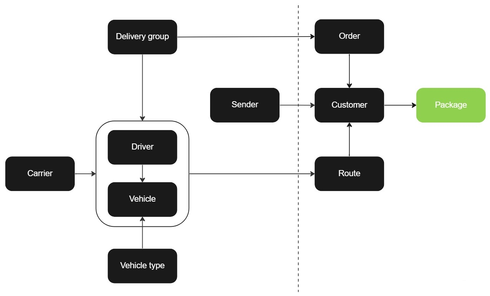

# Package

Packages can be created either after a [customer order](customer_order.md) has been established or simultaneously during the customer order creation process. The package request function is limited to retrieving or updating existing packages.

