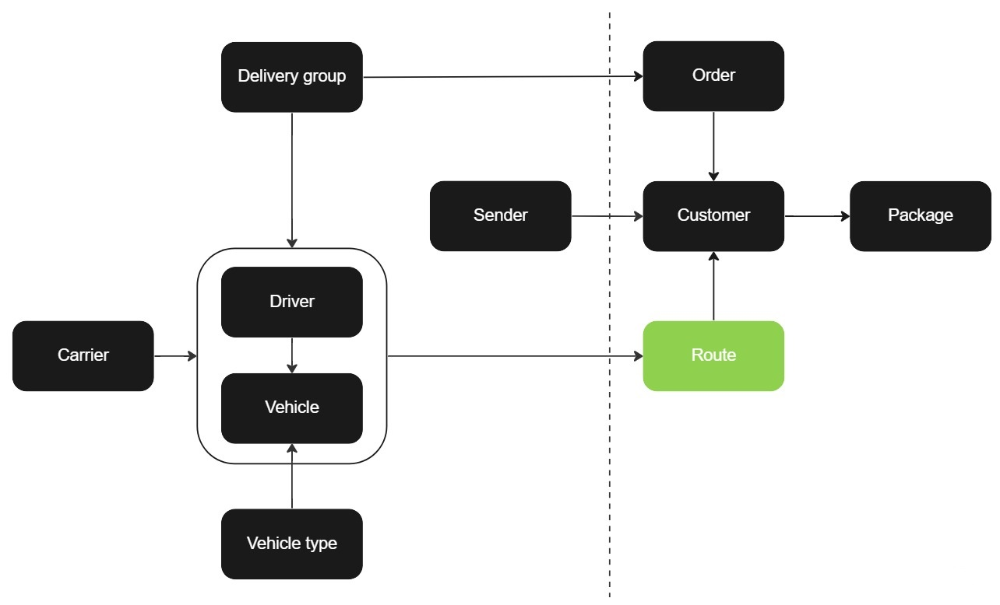

# Route

To create a route, you need to first have ordered a [vehicle](vehicle.md). The route is linked to the vehicle and from there, multiple routes can be merged into a single routing order for one or more [customer orders](customer_order.md). The Route API offers a range of functionality, including adding, retrieving, updating, packaging and creating unit loads for packaging purposes.

