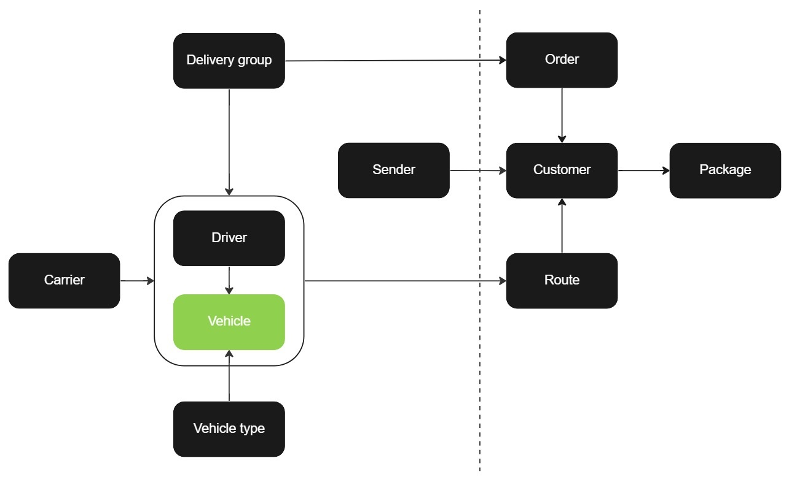

# Vehicle

Vehicles are a crucial component in the delivery process and must be linked to a pre-existing [delivery group](delivery_group.md) to be created. Additionally, they may also be associated with a [carrier](carrier.md) if necessary. The creation of [routes](route.md) is dependent on the availability of vehicles. The API encompasses various functions for managing vehicles, including adding, retrieving, updating and deleting them.

