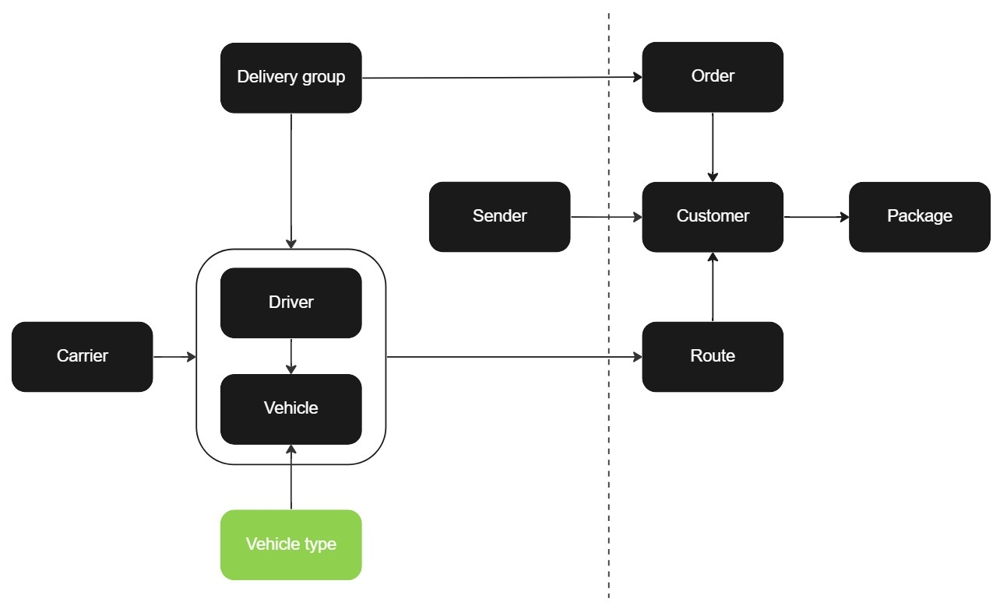

# Vehicle type

It's worth noting that vehicle types can only be created after a [vehicle](vehicle.md) has been created. Once a vehicle is created, you can then create a vehicle type and associate it with the vehicle. Additionally, it's important to keep in mind that the vehicle type field is optional for route optimization. The vehicle type API allows for the addition, retrieval, or deletion of vehicle types

